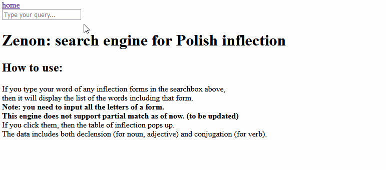

# Zenon
The search engine for case inflections in Polish.

[The running app](https://zenon-frontend.vercel.app/)

# Functionality

Type a Polish word of any forms in the searchbox. Then it displays the word lists that have the matches with the form that you entered.
Upon clicking a word, then you can see the inflection table of that word.

> [!NOTE] 
> Only the words that have full match to your query will show up in the word list. The partial-match search is yet to be implemented.

# Development roadmap

- Faster search
- Better UI
- Implementation of partial-match search
- Add more information in word pages (meaning, pronunciation, root of words, etc...)

# Credits

The data comes from [kaikki.org](https://kaikki.org/) of [Wiktextract](https://github.com/tatuylonen/wiktextract) project,
that extracted word information from [English Wiktionary](https://en.wiktionary.org/).
I would like to appreciate [Dr. Tatu Ylonen](https://ylonen.org/) for the work in Wiktextract,
as well as anonymous Wiktionary editors, all of who made this project possible.

This project was inspired by the search engine for Polish declension [Odmiana.NET](https://odmiana.net/),
and the one for conjugation [Cooljugator: the Smart Verb Conjugator](https://cooljugator.com/).
These previous works focuses solely on either declension or conjugation, while
this project covers both declension and conjugation from the single searchbox.

# Links:
[Dagster UI](https://zenon-etl.fly.dev/) for ETL orchestration of this project

[Swagger UI](https://zenon-backend.fly.dev/docs) for API documentation of backend
